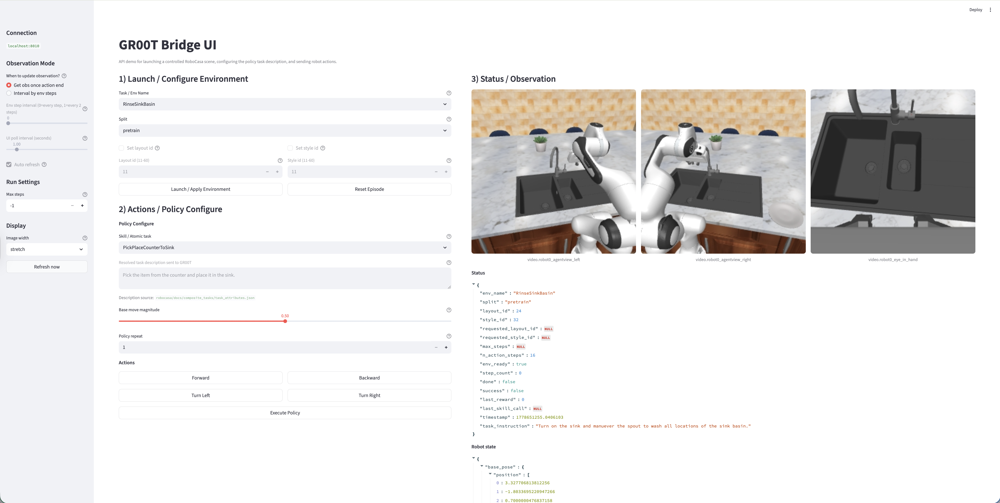

## NVIDIA Isaac GR00T (for AI 617)

This is the NVIDIA Isaac GR00T fork repo for running RoboCasa benchmark experiments. This fork is based on the original [GR00T code](https://github.com/NVIDIA/Isaac-GR00T) from NVIDIA. Our fork supports training for **GR00T N1.5**.



## Recommended system specs

For inference we recommend a GPU with at least 8 Gb of memory. (5090 Recommended)

### Install

Step0: Create conda env and project folder

```bash
conda create -c conda-forge -n robocasa python=3.11
conda activate robocasa

mkdir -p ~/workbench/AI_617
```

Step1: Install robosuite and robocasa [Document](https://robocasa.ai/docs/build/html/introduction/installation.html)

```bash
cd ~/workbench/AI_617
git clone https://github.com/ARISE-Initiative/robosuite
cd robosuite
pip install -e .

cd ~/workbench/AI_617
git clone https://github.com/robocasa/robocasa
cd robocasa
pip install -e .

python -m robocasa.scripts.setup_macros              # Set up system variables.
python -m robocasa.scripts.download_kitchen_assets   # Caution: Assets to be downloaded are around 10GB.
```

Step2: Install GR00T-N1.5 

```bash
cd ~/workbench/AI_617
git clone git@github.com:cckaixin/GR00T-robocasa.git
cd GR00T-robocasa

pip uninstall torch torchvision torchaudio -y   # if installed other version. uninstall first.
pip install --pre torch torchvision torchaudio --index-url https://download.pytorch.org/whl/nightly/cu128   # This is for my 5050 pick one suits your GPU 
pip install -e .
pip install --no-build-isolation flash-attn==2.7.1.post4  # This will take 30-60mins

pip uninstall tensorflow -y
pip install --force-reinstall opencv-python-headless opencv-python
pip install numpy==2.2.5
pip install streamlit
```

## Download Policy CKPT

You need first install huggingface-cli and login with your token

```bash
cd ~/workbench/AI_617
hf download robocasa/robocasa365_checkpoints \
  --include "gr00t_n1-5/foundation_model_learning/target_posttraining/composite_seen/checkpoint-60000/*" \
  --local-dir ./checkpoint-60000 \
  --repo-type model
```

## Run single env (test installation)

With MuJoCo UI:

```bash
cd ~/workbench/AI_617/GR00T-robocasa

python scripts/run_single_env.py \
    --model_path ../checkpoint-60000/gr00t_n1-5/foundation_model_learning/target_posttraining/composite_seen/checkpoint-60000 \
    --env_name RinseSinkBasin \
    --split target
```

Headless mode for SSH/server runs:

```bash
cd ~/workbench/AI_617/GR00T-robocasa

python scripts/run_single_env.py \
    --model_path ../checkpoint-60000/gr00t_n1-5/foundation_model_learning/target_posttraining/composite_seen/checkpoint-60000 \
    --env_name RinseSinkBasin \
    --split target \
    --headless
```

---

## Agentic bridge API

Terminal 1: start the bridge server. It loads GR00T but does not launch a simulator until the UI/API asks for one.

```bash
cd ~/workbench/AI_617/GR00T-robocasa
conda activate robocasa
export LD_LIBRARY_PATH="$CONDA_PREFIX/lib:${LD_LIBRARY_PATH}"   # recommended for flash-attn runtime

python scripts/run_agentic_bridge.py \
    --model_path ../checkpoint-60000/gr00t_n1-5/foundation_model_learning/target_posttraining/composite_seen/checkpoint-60000 \
    --port 8010 \
    --headless
```

Terminal 2: open the Streamlit API demo.

```bash
cd ~/workbench/AI_617/GR00T-robocasa
conda activate robocasa
streamlit run scripts/demo_agentic_bridge.py -- --host localhost --port 8010
```

Use the UI to launch/configure the RoboCasa environment, view observations, move the base, and execute GR00T with a selected atomic skill description. `--headless` avoids opening the MuJoCo viewer on SSH/server runs; camera observations still work.

<details>
<summary>API details for agent-team integration</summary>

Core endpoints:

- `status`, `reset`
- `configure_environment`
- `get_agent_observation`
- `get_robot_state`
- `move`
- `call_skill`
- `list_policy_skills`
- `resolve_skill_description`

Skill behavior:

- `call_skill({"name": "<AtomicTaskName>"})` keeps the current environment.
- The bridge resolves the atomic task name to a RoboCasa language description before calling GR00T.
- If the selected skill is the current environment, it uses the current episode's generated `lang`; otherwise it uses RoboCasa's documented atomic-task description template.

`max_steps`:

- `-1`: no bridge-imposed episode step limit.
- `0`: RoboCasa default task horizon.
- Positive integer: explicit step limit.

Minimal Python client:

```python
from gr00t.eval.service import BaseInferenceClient

client = BaseInferenceClient(host="localhost", port=8010)
print(client.call_endpoint("status", requires_input=False))
obs = client.call_endpoint("get_agent_observation", requires_input=False)
actions = client.call_endpoint("list_viable_skills", requires_input=False)
policy_skills = client.call_endpoint("list_policy_skills", requires_input=False)
resolved = client.call_endpoint("resolve_skill_description", {"name": "OpenDrawer"})
client.call_endpoint("move", {"command": "forward", "magnitude": 0.5, "repeat": 1})
client.call_endpoint("call_skill", {"name": "OpenDrawer", "params": {"repeat": 1}})
```

</details>

### Streamlit UI notes

- **Launch first from UI**: choose `Task / Env Name`, `split`, optional `layout_id` / `style_id`, then click `Launch / Apply Environment`.
- **Policy Configure**: choose an atomic skill; the UI shows the resolved description sent to GR00T.
- **Max steps**: this is in the sidebar under `Run Settings`; default `-1` means no bridge-imposed step limit.
- **Scene control rule**: explicit `layout_id` / `style_id` requires `split=custom`.
- **Important**: start Streamlit with `streamlit run ...`, not `python scripts/demo_agentic_bridge.py`.

## Troubleshooting

If you see:

- `ImportError: ... libstdc++.so.6: version 'CXXABI_1.3.15' not found`
- or failure importing `flash_attn_2_cuda`

Install conda C++ runtime in your env:

```bash
conda activate robocasa
conda install -y -c conda-forge libstdcxx-ng libgcc-ng
```

## Relevant Document

1. Robocasa: [https://robocasa.ai/docs/build/html/introduction/overview.html](https://robocasa.ai/docs/build/html/introduction/overview.html)
2. RoboCLAW: [https://arxiv.org/abs/2603.11558](https://arxiv.org/abs/2603.11558)
3. RoboCLAW (code): [https://github.com/MINT-SJTU/RoboClaw](https://github.com/MINT-SJTU/RoboClaw)
